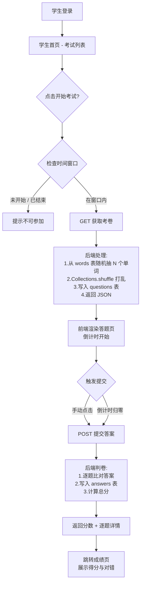
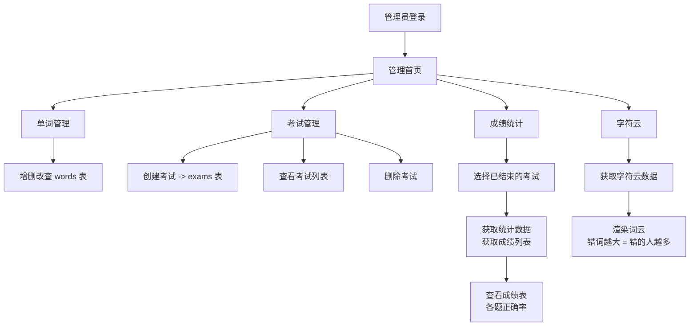
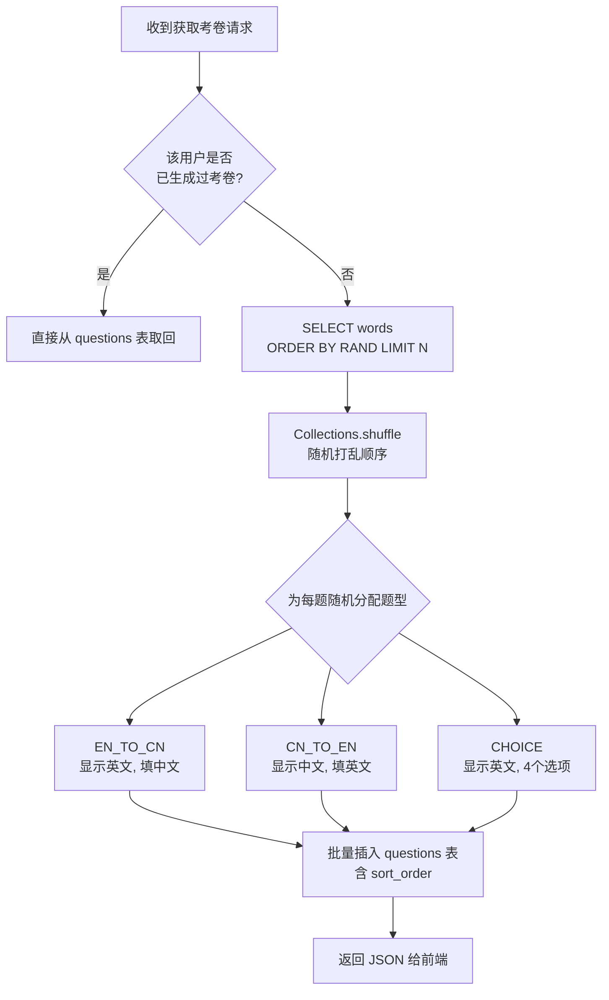
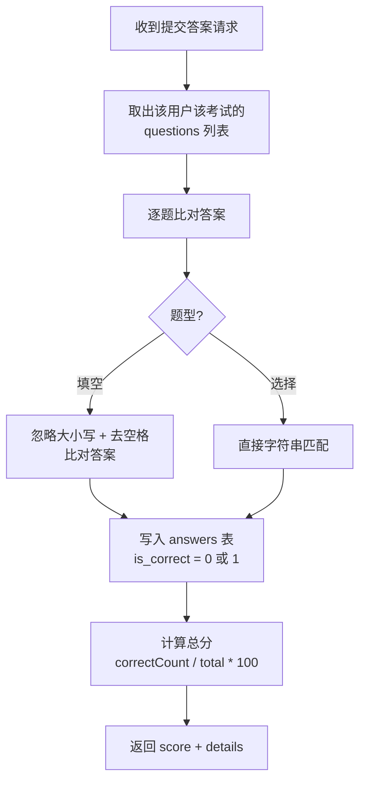
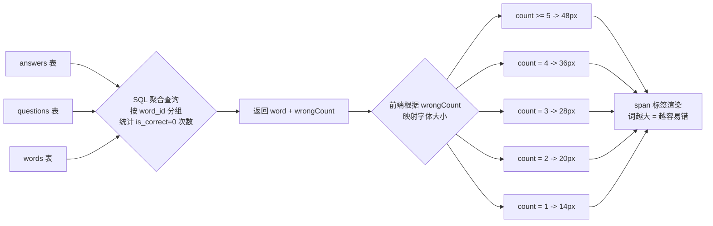

# 核心业务流程图

---

## 一、学生考试流程

```mermaid
flowchart TD
    A["学生登录"] --> B["学生首页 - 考试列表"]
    B --> C{"点击开始考试?"}
    C --> D{"检查时间窗口"}
    D -->|"未开始 / 已结束"| E["提示不可参加"]
    D -->|"在窗口内"| F["GET 获取考卷"]
    F --> G["后端处理:\n1.从 words 表随机抽 N 个单词\n2.Collections.shuffle 打乱\n3.写入 questions 表\n4.返回 JSON"]
    G --> H["前端渲染答题页\n倒计时开始"]
    H --> I{"触发提交"}
    I -->|"手动点击"| J["POST 提交答案"]
    I -->|"倒计时归零"| J
    J --> K["后端判卷:\n1.逐题比对答案\n2.写入 answers 表\n3.计算总分"]
    K --> L["返回分数 + 逐题详情"]
    L --> M["跳转成绩页\n展示得分与对错"]
```

---

## 二、管理员操作流程

```mermaid
flowchart TD
    A["管理员登录"] --> B["管理首页"]
    B --> C["单词管理"]
    B --> D["考试管理"]
    B --> E["成绩统计"]
    B --> F["字符云"]

    C --> C1["增删改查 words 表"]

    D --> D1["创建考试 -> exams 表"]
    D --> D2["查看考试列表"]
    D --> D3["删除考试"]

    E --> E1["选择已结束的考试"]
    E1 --> E2["获取统计数据\n获取成绩列表"]
    E2 --> E3["查看成绩表\n各题正确率"]

    F --> F1["获取字符云数据"]
    F1 --> F2["渲染词云\n错词越大 = 错的人越多"]
```

---

## 三、组卷核心逻辑

```mermaid
flowchart TD
    A["收到获取考卷请求"] --> B{"该用户是否\n已生成过考卷?"}
    B -->|"是"| C["直接从 questions 表取回"]
    B -->|"否"| D["SELECT words\nORDER BY RAND LIMIT N"]
    D --> E["Collections.shuffle\n随机打乱顺序"]
    E --> F{"为每题随机分配题型"}
    F --> G["EN_TO_CN\n显示英文, 填中文"]
    F --> H["CN_TO_EN\n显示中文, 填英文"]
    F --> I["CHOICE\n显示英文, 4个选项"]
    G --> J["批量插入 questions 表\n含 sort_order"]
    H --> J
    I --> J
    J --> K["返回 JSON 给前端"]
```

---

## 四、判卷核心逻辑

```mermaid
flowchart TD
    A["收到提交答案请求"] --> B["取出该用户该考试的\nquestions 列表"]
    B --> C["逐题比对答案"]
    C --> D{"题型?"}
    D -->|"填空"| E["忽略大小写 + 去空格\n比对答案"]
    D -->|"选择"| F["直接字符串匹配"]
    E --> G["写入 answers 表\nis_correct = 0 或 1"]
    F --> G
    G --> H["计算总分\ncorrectCount / total * 100"]
    H --> I["返回 score + details"]
```

---

## 五、字符云数据生成

```mermaid
flowchart LR
    A["answers 表"] --> B{"SQL 聚合查询\n按 word_id 分组\n统计 is_correct=0 次数"}
    C["questions 表"] --> B
    D["words 表"] --> B
    B --> E["返回 word + wrongCount"]
    E --> F{"前端根据 wrongCount\n映射字体大小"}
    F --> G["count >= 5 -> 48px"]
    F --> H["count = 4 -> 36px"]
    F --> I["count = 3 -> 28px"]
    F --> J["count = 2 -> 20px"]
    F --> K["count = 1 -> 14px"]
    G --> L["span 标签渲染\n词越大 = 越容易错"]
    H --> L
    I --> L
    J --> L
    K --> L
```
