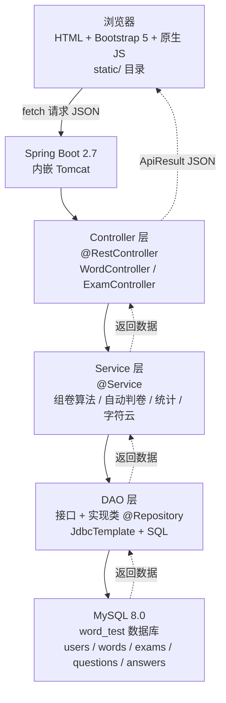

# 系统架构与技术选型

---

## 一、架构图

---

## 二、技术选型

| 层级 | 技术 | 版本 | 选型理由 |
|------|------|:--:|------|
| 后端框架 | Spring Boot | 2.7.18 | 内嵌 Tomcat，约定优于配置，开发效率高 |
| Web 层 | Spring MVC + REST | — | 返回 JSON，不做服务端渲染 |
| 数据库 | MySQL | 8.0 | 课程要求，SQL 标准 |
| 持久层 | JdbcTemplate | — | 比原始 JDBC 简洁，SQL 自控，答辩可解释 |
| 连接池 | HikariCP | — | Spring Boot 默认，无需配置 |
| 前端 | HTML + Bootstrap 5 | 5.3 | CDN 引入，零构建工具，组件丰富 |
| 前端 JS | 原生 fetch | ES6 | 不依赖 jQuery，标准 API |
| 字符云 | 纯 CSS 或 WordCloud2.js | — | 轻量，一个 JS 文件即可 |
| 构建 | Maven | 3.x | 课程常用，资料多 |
| JDK | OpenJDK | 8 | 最稳定，兼容性好 |
| IDE | IntelliJ IDEA | Community | 免费，Spring Boot 支持好 |

---

## 三、为什么不用这些

| 不用 | 原因 |
|------|------|
| JSP / Servlet | 同学不熟悉，开发效率低 |
| Thymeleaf | 同学熟悉 REST API，不需要学模板引擎 |
| MyBatis / JPA | DAO 模式是任务书要求，JdbcTemplate 最贴合参考代码结构 |
| Vue / React | 构建工具链太重，课设不需要 |
| npm / webpack | 纯 HTML 直接放 static 目录就跑，不需要 |
